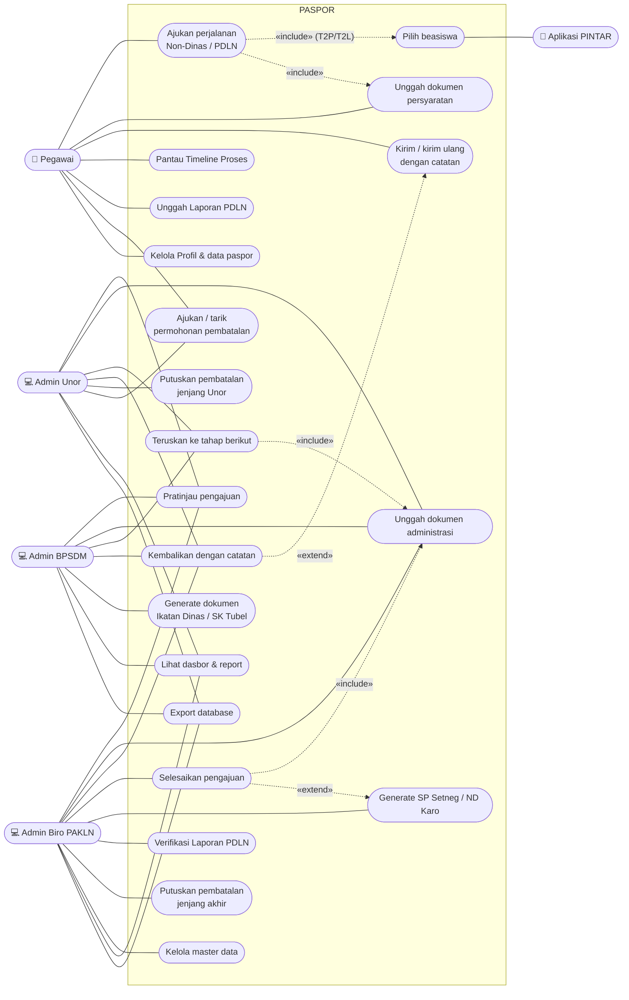

# 01 — Use Case

Acuan: [BISNIS_PROSES_PDLN.MD §3](../instructions/BISNIS_PROSES_PDLN.MD#3-aktor--hak-akses).
Mermaid belum memiliki notasi use case resmi; diagram di bawah memakai
flowchart dengan konvensi: **kotak bersudut tumpul** = aktor,
**stadion** = use case, panah putus-putus berlabel = `«include»` / `«extend»`.

## 1.1 Aktor

| Aktor | Jenis | Keterangan |
|---|---|---|
| Pegawai | Primer | Mengajukan perjalanan (Mobile/Web), melapor, meminta pembatalan |
| Admin Unor | Primer | Verifikator tahap 1, per unit organisasi |
| Admin BPSDM | Primer | Verifikator khusus PDLN Tipe 2 (lintas unor) |
| Admin Biro PAKLN | Primer | Verifikator akhir, pengelola master data |
| Aplikasi PINTAR | Sistem eksternal | Sumber data pencalonan beasiswa (T2P/T2L) |
| Penjadwal (scheduler) | Sistem | Pengingat batas pelaporan |

## 1.2 Diagram use case — gambaran umum

## 1.3 Use case per aktor

### Pegawai

| ID | Use case | Prasyarat | Hasil |
|---|---|---|---|
| UC-P01 | Ajukan perjalanan (pilih jenis & tipe, isi formulir) | Tidak ada pengajuan belum tuntas | Draft `belum`, `form_saved` |
| UC-P02 | Unggah dokumen persyaratan | Draft tersimpan | Berkas tersimpan per jenis |
| UC-P03 | Kirim / kirim ulang | Dokumen wajib lengkap; kirim ulang wajib catatan | `belum → proses` |
| UC-P04 | Pantau Timeline Proses | Pengajuan pernah dikirim | — |
| UC-P05 | Unggah / unggah ulang Laporan PDLN | PDLN `selesai`; unggah ulang wajib catatan | Laporan `menunggu` |
| UC-P06 | Ajukan permohonan pembatalan | Pengajuan pernah dikirim, belum tuntas; alasan wajib | Permohonan `menunggu_unor` |
| UC-P07 | Tarik permohonan pembatalan | Permohonan miliknya belum diputus | Permohonan `ditarik` |
| UC-P08 | Batalkan draft | Draft belum pernah dikirim; alasan wajib | `dibatalkan` |
| UC-P09 | Kelola Profil & data paspor | — | Data paspor/dokumen kepegawaian |
| UC-P10 | Unduh dokumen hasil | Pengajuan `selesai` | Berkas (ILN / dokumen PDLN) |

### Admin Unor

| ID | Use case | Prasyarat | Hasil |
|---|---|---|---|
| UC-U01 | Pratinjau pengajuan | Status `proses`, unor sesuai | `preview_unor_agree` |
| UC-U02 | Kembalikan ke pegawai | Catatan wajib | `proses → belum` |
| UC-U03 | Unggah dokumen administrasi Unor | Pratinjau disetujui | Berkas tahap Unor |
| UC-U04 | Teruskan / teruskan ulang | Dokumen wajib lengkap; teruskan ulang wajib catatan | `→ proses_bpsdm` (T2) / `→ proses_pakln` |
| UC-U05 | Ajukan pembatalan | Pengajuan unornya; alasan wajib | Permohonan `menunggu_pakln` |
| UC-U06 | Putuskan pembatalan jenjang 1 | Permohonan `menunggu_unor`; tolak wajib catatan | `menunggu_pakln` / `ditolak` |
| UC-U07 | Monitor Pelaporan PDLN | — | Read-only |
| UC-U08 | Dasbor, rekap & export | Cakupan unor | — |

### Admin BPSDM

| ID | Use case | Prasyarat | Hasil |
|---|---|---|---|
| UC-B01 | Pratinjau pengajuan Tipe 2 | Status `proses_bpsdm` | `preview_bpsdm_agree` |
| UC-B02 | Kembalikan ke Admin Unor | Catatan wajib | `proses_bpsdm → proses` |
| UC-B03 | Unggah / generate dokumen BPSDM | Pratinjau disetujui | Izin Prinsip, Ikatan Dinas/SK Tubel, ND |
| UC-B04 | Teruskan ke PAKLN | Dokumen wajib lengkap | `→ proses_pakln` |
| UC-B05 | Dasbor & export Tipe 2 | — | — |

### Admin Biro PAKLN

| ID | Use case | Prasyarat | Hasil |
|---|---|---|---|
| UC-K01 | Pratinjau pengajuan | Status `proses_pakln` | `preview_pakln_agree` |
| UC-K02 | Kembalikan ke tahap sebelumnya | Catatan wajib | `→ proses_bpsdm` (T2) / `→ proses` |
| UC-K03 | Unggah / generate dokumen PAKLN | Pratinjau disetujui | SP Setneg, Paspor Dinas, Exit Permit, Visa*, ND Karo |
| UC-K04 | Selesaikan | Dokumen wajib lengkap (visa wajib bila negara memerlukan) | `→ selesai` |
| UC-K05 | Verifikasi Laporan PDLN | Laporan `menunggu`; kembalikan wajib catatan | `disetujui` / `dikembalikan` |
| UC-K06 | Putuskan pembatalan jenjang akhir | Permohonan `menunggu_pakln`; tolak wajib catatan | `dibatalkan` / `ditolak` |
| UC-K07 | Kelola master data | — | Kategori/sumber per tipe, negara `perlu_visa`, template, kalender, user |
| UC-K08 | Dasbor, rekap & export | Semua data | — |
