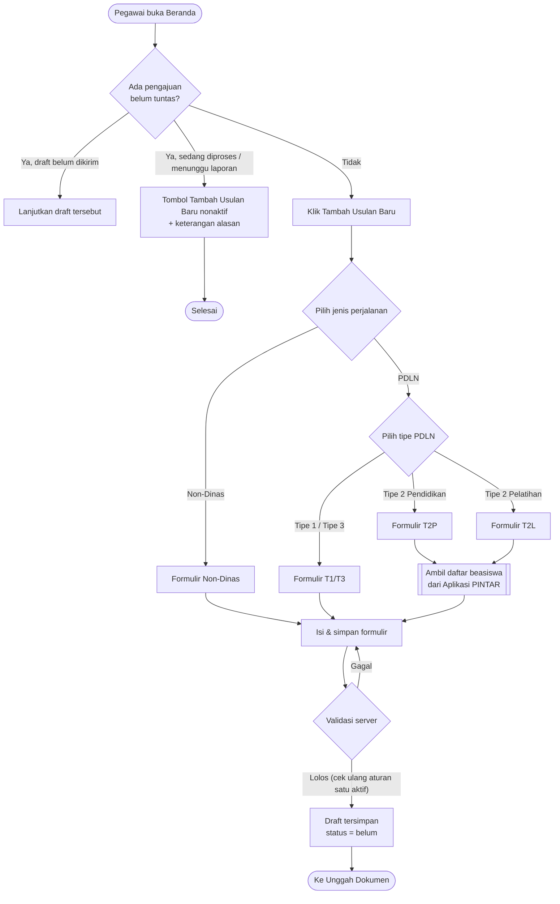
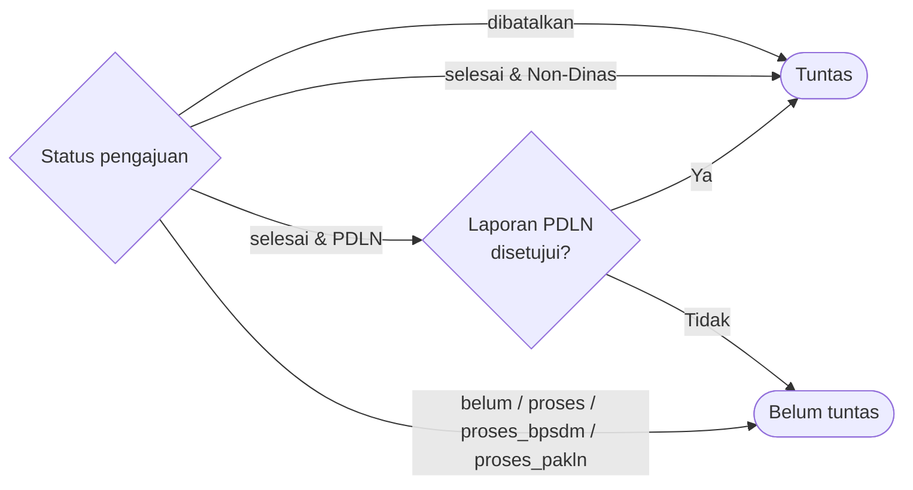
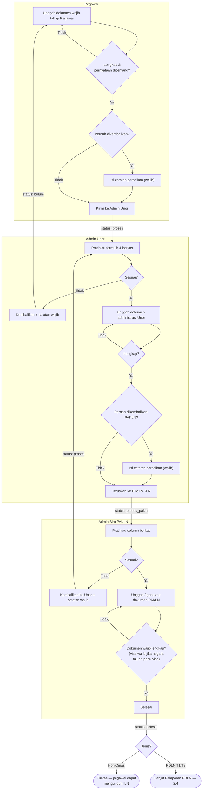
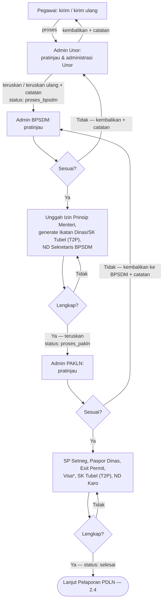
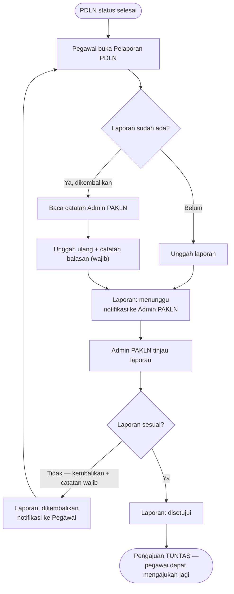
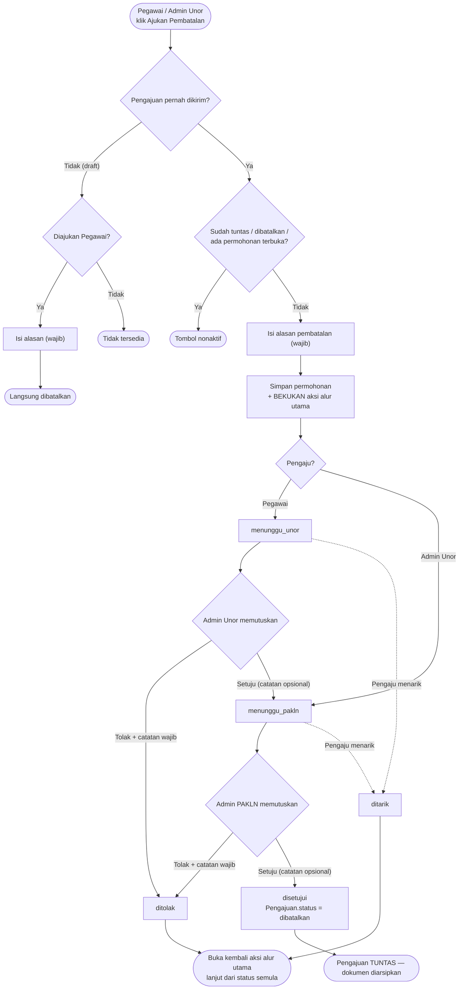
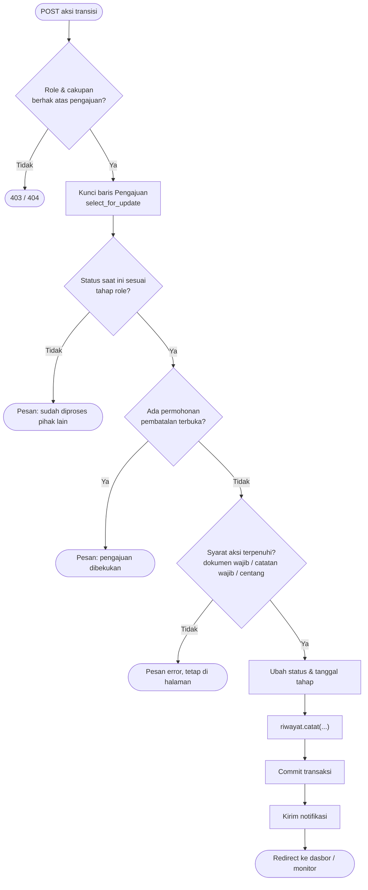

# 02 — Flowchart / Activity Diagram

Acuan: [BISNIS_PROSES_PDLN.MD §2.1, §4, §7](../instructions/BISNIS_PROSES_PDLN.MD#4-alur-proses-per-tipe).
Setiap kotak keputusan yang mengubah status juga mencatat
`RiwayatPengajuan` dan mengirim notifikasi (tidak digambar ulang di
setiap flowchart agar ringkas).

## 2.1 Memulai pengajuan baru (aturan satu pengajuan aktif)

**Definisi "tuntas"** (pengajuan yang tidak lagi menghalangi pengajuan baru):

## 2.2 Alur utama — Non-Dinas, PDLN Tipe 1, PDLN Tipe 3

## 2.3 Alur PDLN Tipe 2 (Pendidikan & Pelatihan) — dengan BPSDM

*Visa wajib bila salah satu negara tujuan bertanda `perlu_visa`.

## 2.4 Pelaporan PDLN

## 2.5 Pembatalan (mekanisme interim)

## 2.6 Kirim/teruskan — validasi umum di server

Diterapkan pada semua tombol transisi (Kirim, Teruskan, Selesai, Kembalikan).

