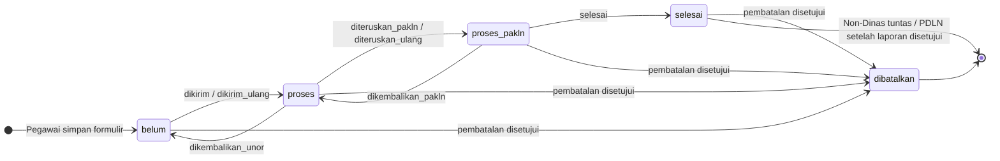
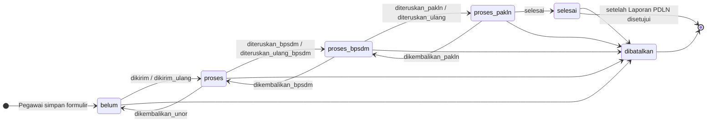
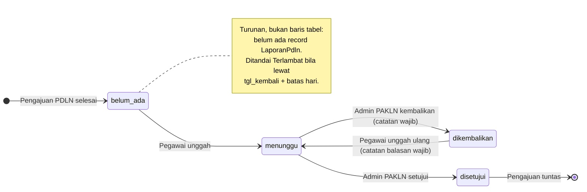
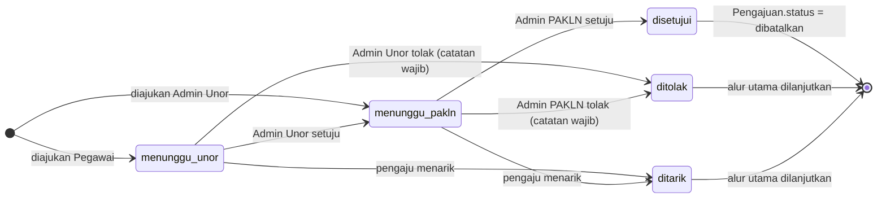

# 03 — State Diagram

Acuan: [BISNIS_PROSES_PDLN.MD §4.1, §4.4, §4.5](../instructions/BISNIS_PROSES_PDLN.MD#41-status).

## 3.1 Status `Pengajuan` — Non-Dinas, PDLN Tipe 1 & Tipe 3

## 3.2 Status `Pengajuan` — PDLN Tipe 2 (T2P/T2L)

Catatan:

- Transisi ke `dibatalkan` hanya terjadi saat **Admin PAKLN menyetujui**
  permohonan pembatalan (3.4). Draft yang belum pernah dikirim dapat
  langsung dibatalkan pegawai.
- Selama permohonan pembatalan terbuka, **tidak ada transisi lain** yang
  boleh terjadi (status dibekukan).

## 3.3 Status `LaporanPdln`

Berjalan di dalam `Pengajuan.status = selesai` (khusus PDLN).

## 3.4 Status `PermohonanPembatalan`

## 3.5 Matriks aksi per status (siapa boleh melakukan apa)

| Status `Pengajuan` | Pegawai | Admin Unor | Admin BPSDM | Admin PAKLN |
|---|---|---|---|---|
| `belum` (draft) | Edit, unggah, kirim, batalkan draft | — | — | — |
| `belum` (dikembalikan) | Perbaiki, kirim ulang (catatan), ajukan batal | Ajukan batal | — | — |
| `proses` | Lihat, ajukan batal | Pratinjau, kembalikan, unggah, teruskan, ajukan batal | — | — |
| `proses_bpsdm` | Lihat, ajukan batal | Lihat, ajukan batal | Pratinjau, kembalikan, unggah, teruskan | — |
| `proses_pakln` | Lihat, ajukan batal | Lihat, ajukan batal | Lihat (T2) | Pratinjau, kembalikan, unggah, selesaikan |
| `selesai` (Non-Dinas) | Unduh ILN, ajukan batal (s.d. tgl berangkat) | Ajukan batal | — | — |
| `selesai` (PDLN) | Unggah laporan, unduh dokumen, ajukan batal (selama laporan belum disetujui) | Ajukan batal, monitor laporan | Lihat (T2) | Verifikasi laporan |
| `dibatalkan` | Lihat | Lihat | Lihat (T2) | Lihat |
| *Permohonan pembatalan terbuka* | Tarik (jika pengaju) | Putuskan jenjang 1 / tarik (jika pengaju) | Lihat | Putuskan jenjang akhir |
