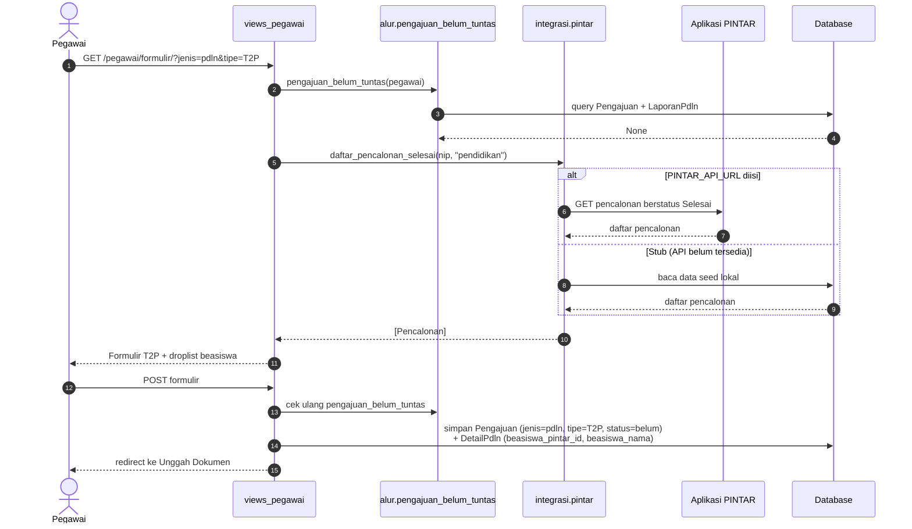
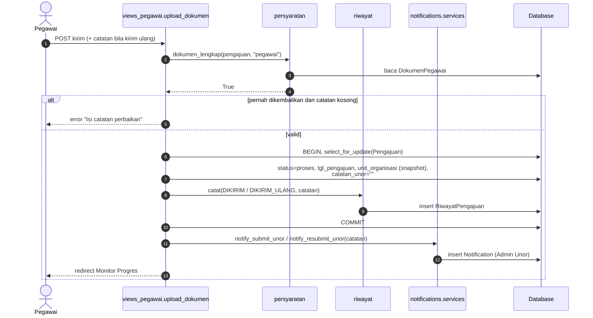
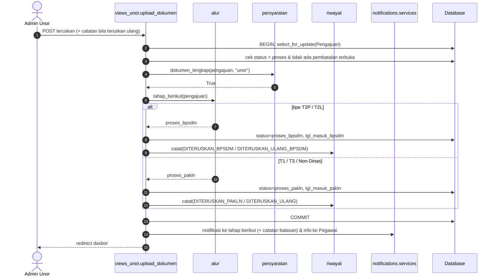
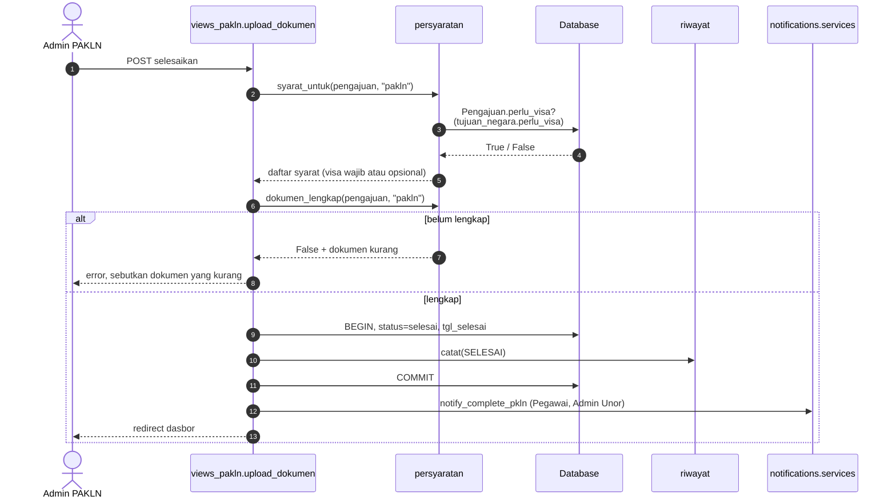
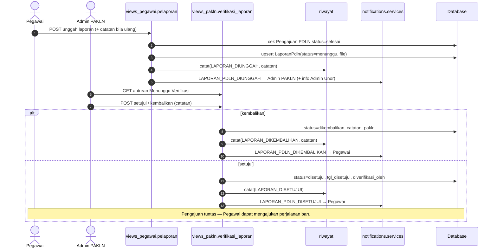
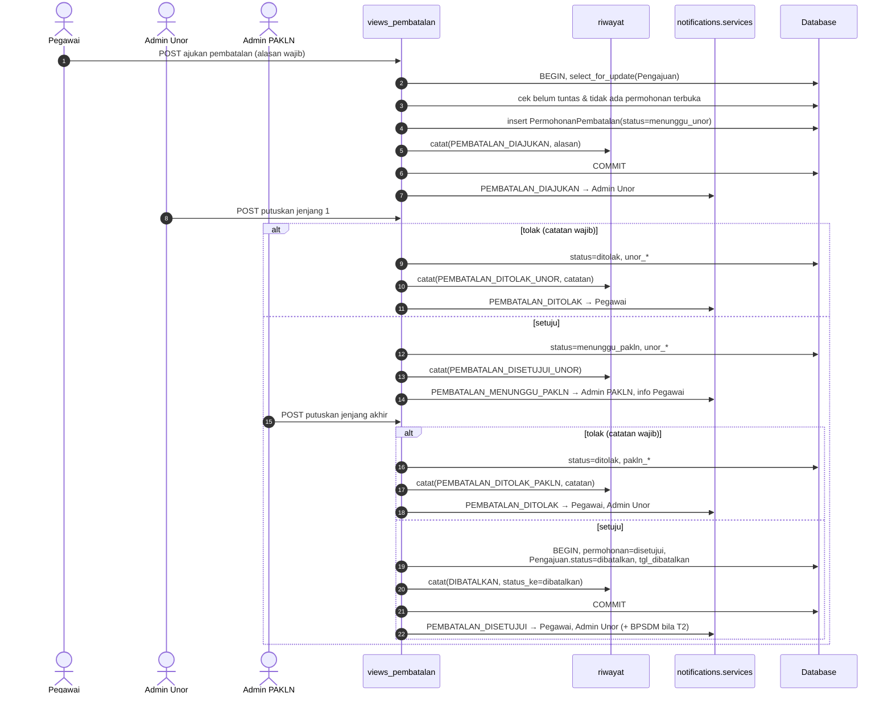
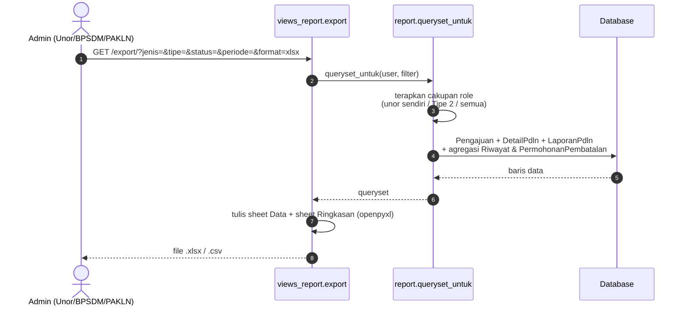

# 04 — Sequence Diagram

Menggambarkan interaksi antara pengguna, view Django, modul layanan
(`pengajuan/alur.py`, `pengajuan/persyaratan.py`, `pengajuan/riwayat.py`,
`notifications/services.py`, `paspor/integrasi/pintar.py`), dan database.
Nama modul mengikuti rancangan di
[BISNIS_PROSES_PDLN.MD §6.5, §12, §13](../instructions/BISNIS_PROSES_PDLN.MD#13-tahapan-implementasi).

## 4.1 Pegawai mengisi formulir PDLN Tipe 2 (dengan Aplikasi PINTAR)

## 4.2 Pegawai mengirim / mengirim ulang pengajuan

## 4.3 Admin Unor meneruskan pengajuan (Tipe 2 → BPSDM, lainnya → PAKLN)

## 4.4 Admin PAKLN menyelesaikan pengajuan (aturan visa)

## 4.5 Unggah dan verifikasi Laporan PDLN

## 4.6 Pembatalan berjenjang

Bila diajukan oleh **Admin Unor**, langkah "putuskan jenjang 1" dilewati:
permohonan langsung dibuat berstatus `menunggu_pakln` dengan kolom
`unor_*` diisi dari pengaju.

## 4.7 Export database terpadu

