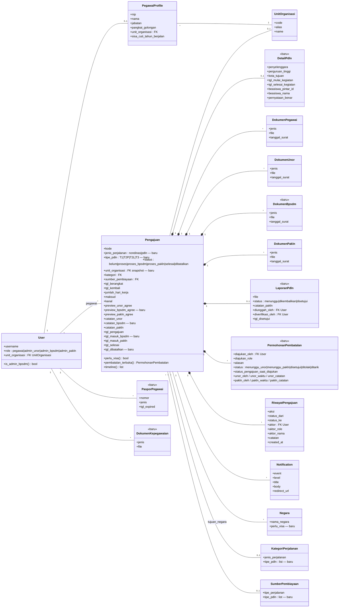
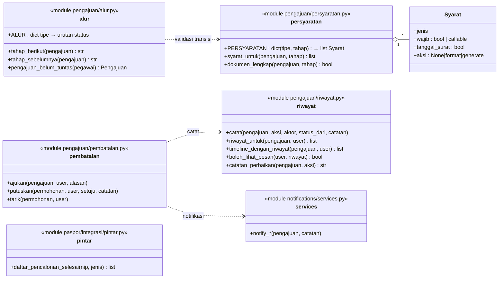

# 05 — Class Diagram & ERD

Acuan: [BISNIS_PROSES_PDLN.MD §8](../instructions/BISNIS_PROSES_PDLN.MD#8-struktur-data--database).
Penanda: **«baru» / — baru / "baru"** = tabel/field baru; tanpa penanda = sudah ada.

## 5.1 Class diagram — model inti

## 5.2 Class diagram — modul layanan (non-model)

## 5.3 Entity Relationship Diagram

```mermaid
erDiagram
    accounts_user ||--o| accounts_pegawaiprofile : memiliki
    accounts_user ||--o{ pengajuan_pengajuan : mengajukan
    accounts_user ||--o{ accounts_pasporpegawai : memiliki
    accounts_user ||--o{ accounts_dokumenkepegawaian : memiliki
    org_units ||--o{ accounts_pegawaiprofile : menaungi
    org_units ||--o{ pengajuan_pengajuan : snapshot_unor

    pengajuan_pengajuan ||--o| pengajuan_detailpdln : detail
    pengajuan_pengajuan ||--o{ pengajuan_dokumenpegawai : berkas
    pengajuan_pengajuan ||--o{ pengajuan_dokumenunor : berkas
    pengajuan_pengajuan ||--o| pengajuan_dokumenunorpendukung : berkas
    pengajuan_pengajuan ||--o{ pengajuan_dokumenbpsdm : berkas
    pengajuan_pengajuan ||--o{ pengajuan_dokumenpakln : berkas
    pengajuan_pengajuan ||--o| pengajuan_dokumenpaklnpendukung : berkas
    pengajuan_pengajuan ||--o| pengajuan_laporanpdln : laporan
    pengajuan_pengajuan ||--o{ pengajuan_permohonanpembatalan : pembatalan
    pengajuan_pengajuan ||--o{ pengajuan_riwayatpengajuan : riwayat
    pengajuan_pengajuan ||--o{ notifications_notification : notifikasi
    pengajuan_pengajuan }o--o{ paspor_negara : tujuan
    paspor_kategoriperjalanan ||--o{ pengajuan_pengajuan : kategori
    paspor_sumberpembiayaan ||--o{ pengajuan_pengajuan : sumber

    pengajuan_pengajuan {
        int id PK
        varchar kode UK
        int pegawai_id FK
        varchar jenis_perjalanan "baru, index"
        varchar tipe_pdln "baru"
        varchar status "index"
        int unit_organisasi_id FK "baru, snapshot"
        int kategori_id FK
        int sumber_pembiayaan_id FK
        date tgl_berangkat
        date tgl_kembali
        int jumlah_hari_kerja
        text maksud
        varchar kanal
        bool preview_unor_agree
        bool preview_bpsdm_agree "baru"
        bool preview_pakln_agree
        text catatan_unor
        text catatan_bpsdm "baru"
        text catatan_pakln
        date tgl_pengajuan
        date tgl_masuk_bpsdm "baru"
        date tgl_masuk_pakln
        date tgl_selesai
        date tgl_dibatalkan "baru"
    }
    pengajuan_detailpdln {
        int id PK
        int pengajuan_id FK "unique"
        varchar penyelenggara
        varchar perguruan_tinggi
        varchar kota_tujuan
        date tgl_mulai_kegiatan
        date tgl_selesai_kegiatan
        varchar beasiswa_pintar_id
        varchar beasiswa_nama
        bool pernyataan_benar
    }
    pengajuan_dokumenbpsdm {
        int id PK
        int pengajuan_id FK
        varchar jenis "unique per pengajuan"
        varchar file
        date tanggal_surat
        datetime uploaded_at
    }
    pengajuan_laporanpdln {
        int id PK
        int pengajuan_id FK "unique"
        varchar file
        varchar status "menunggu, dikembalikan, disetujui"
        text catatan_pakln
        int diunggah_oleh_id FK
        datetime uploaded_at
        int diverifikasi_oleh_id FK
        datetime tgl_disetujui
    }
    pengajuan_permohonanpembatalan {
        int id PK
        int pengajuan_id FK
        int diajukan_oleh_id FK
        varchar diajukan_role
        text alasan "wajib"
        varchar status "index"
        varchar status_pengajuan_saat_diajukan
        int unor_oleh_id FK
        datetime unor_waktu
        text unor_catatan
        int pakln_oleh_id FK
        datetime pakln_waktu
        text pakln_catatan
        datetime created_at
    }
    pengajuan_riwayatpengajuan {
        int id PK
        int pengajuan_id FK
        varchar aksi
        varchar status_dari
        varchar status_ke
        int aktor_id FK
        varchar aktor_role
        varchar aktor_nama
        text catatan
        datetime created_at
    }
    paspor_negara {
        int id PK
        varchar nama_negara UK
        bool perlu_visa "baru"
        bool is_active
    }
    accounts_pasporpegawai {
        int id PK
        int pegawai_id FK
        varchar nomor
        varchar jenis
        date tgl_expired
    }
```

## 5.4 Index yang disarankan

| Tabel | Index | Untuk |
|---|---|---|
| `pengajuan_pengajuan` | `(jenis_perjalanan, tipe_pdln, status)` | Dasbor & filter report |
| `pengajuan_pengajuan` | `(unit_organisasi_id, status)` | Cakupan Admin Unor |
| `pengajuan_pengajuan` | `(status, tgl_pengajuan)` | Rekap per periode |
| `pengajuan_pengajuan` | `(pegawai_id, status)` | Aturan satu pengajuan aktif |
| `pengajuan_laporanpdln` | `(status)` | Antrean verifikasi |
| `pengajuan_permohonanpembatalan` | `(pengajuan_id, status)` | Cek permohonan terbuka, antrean |
| `pengajuan_riwayatpengajuan` | `(pengajuan_id, created_at)` *(sudah ada)* | Timeline & SLA |
