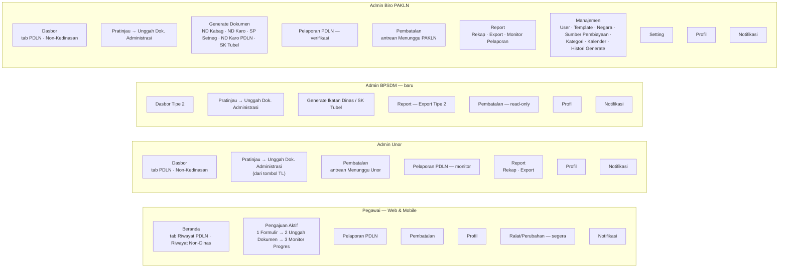

# 06 — Desain Menu & Layout

Acuan: [BISNIS_PROSES_PDLN.MD §9–§10](../instructions/BISNIS_PROSES_PDLN.MD#9-halaman--navigasi),
mockup Tahap 2, dan layout yang berjalan saat ini
([_sidebar.html](../../templates/partials/_sidebar.html), [base.html](../../templates/base.html)).

Wireframe di bawah menggambarkan **susunan dan isi**, bukan desain visual
final. Komponen memakai kelas yang sudah ada (`.box`, `.section-title`,
`.timeline`, `.riwayat-list`, `.notification.paspor-msg`, `.preview-split`,
`.agree-box`, `.doc-row`, `.tag.paspor-status`, DataTables server-side).

Legenda wireframe:

| Simbol | Arti |
|---|---|
| `[ Tombol ]` | Tombol aksi |
| `[ Tombol ]░` | Tombol nonaktif |
| `( ) / (•)` | Radio / pilihan |
| `[x] / [ ]` | Checkbox |
| `[____]` | Input teks / tanggal |
| `[ Pilih ▾ ]` | Dropdown |
| `● ✓ ○` | Status tahap timeline: aktif / selesai / belum |
| `⚠ ↻ ✕` | Banner peringatan / balasan perbaikan / pembatalan |

---

## 6.1 Peta menu per role



### Struktur sidebar (usulan)

```
PEGAWAI                     ADMIN UNOR                  ADMIN BPSDM (baru)          ADMIN BIRO PAKLN
─────────────────────       ─────────────────────       ─────────────────────       ──────────────────────────
MENU                        MENU                        MENU                        MENU
 ▸ Beranda                   ▸ Dasbor                    ▸ Dasbor                    ▸ Dasbor
 ▸ Pelaporan PDLN    (baru)  ▸ Pembatalan  ③   (baru)    ▸ Generate Dokumen          ▸ Pelaporan PDLN  ⑤  (baru)
 ▸ Pembatalan        (baru)  ▸ Pelaporan PDLN   (baru)   ▸ Pembatalan (lihat)        ▸ Pembatalan      ②  (baru)
 ▸ Profil            (baru)  ▸ Report ▾          (baru)  ▸ Report ▾                  ▸ Generate Dokumen ▾
 ▸ Ralat/Perubahan   (segera)     · Rekap                     · Export Tipe 2             · ND Kabag / ND Karo
                                  · Export                                                · SP Setneg / ND Karo PDLN
                                                                                          · SK Tubel
                                                                                       ▸ Report ▾          (baru)
                                                                                          · Rekap · Export
                                                                                          · Monitor Pelaporan
                                                                                       ▸ Manajemen ▾
                                                                                       ▸ Setting
LAINNYA                     LAINNYA                     LAINNYA                     LAINNYA
 ▸ Profil                    ▸ Profil                    ▸ Profil                    ▸ Profil
 ▸ Notifikasi  ⑦             ▸ Notifikasi                ▸ Notifikasi                ▸ Notifikasi
 ▸ Keluar                    ▸ Keluar                    ▸ Keluar                    ▸ Keluar
```

Angka berlingkar (③ ② ⑤ ⑦) = badge jumlah item yang **perlu tindakan
role tersebut**, sama seperti badge notifikasi yang sudah ada.

---

## 6.2 Kerangka layout

### Web (semua role)

```
┌──────────────────────────────────────────────────────────────────────────────────┐
│ ☰  PASPOR · Platform Administrasi Surat Perjalanan…     [Admin Unor] (AU) Keluar │  ← _header.html
├───────────────┬──────────────────────────────────────────────────────────────────┤
│ MENU          │  Judul Halaman                                [ Aksi utama ]     │  ← .page-head
│ ▸ Dasbor      │  sub-judul / kode pengajuan                                      │
│ ▸ Pembatalan ③│ ┌──────────────────────────────────────────────────────────────┐ │
│ ▸ ...         │ │ ⚠ Banner kontekstual (dikembalikan / perbaikan / pembatalan) │ │  ← .paspor-msg
│               │ └──────────────────────────────────────────────────────────────┘ │
│ LAINNYA       │ ┌──────────────────────────────────────────────────────────────┐ │
│ ▸ Profil      │ │ Konten (.box)                                                │ │
│ ▸ Notifikasi  │ │                                                              │ │
│ ▸ Keluar      │ └──────────────────────────────────────────────────────────────┘ │
└───────────────┴──────────────────────────────────────────────────────────────────┘
```

### Mobile (Pegawai, via Satu Bravo)

```
┌──────────────────────────┐
│ ← Kembali ke Satu Bravo  │
├──────────────────────────┤
│ ←  Judul       sub-judul │  ← app-topbar
├──────────────────────────┤
│                          │
│  Konten satu kolom       │
│  (kartu bertumpuk)       │
│                          │
│ [ Aksi utama — lebar ]   │
├──────────────────────────┤
│ Beranda  Progres  Bantuan│  ← bottom-nav
└──────────────────────────┘
```

---

## 6.3 Pegawai

### 6.3.1 Beranda

```
┌──────────────────────────────────────────────────────────────────────────────┐
│ Beranda                                              [ ➕ Tambah Usulan Baru ]░│
│ Halo, Andra 👋                                                               │
├──────────────────────────────────────────────────────────────────────────────┤
│ ⚠ Anda belum dapat mengajukan perjalanan baru: Laporan PDLN-2026-T1-0003     │
│   belum disetujui Admin Biro PAKLN.                      [ Ke Pelaporan → ]  │
├──────────────────────────────────────────────────────────────────────────────┤
│ [ Riwayat PDLN ]  [ Riwayat Non-Dinas ]                                      │
│ ┌────────────────┬──────────────┬────────────┬────────────────┬────────────┬────────┐
│ │ Tipe           │ Tujuan       │ Tgl Ajuan  │ Status         │ Laporan    │ Aksi   │
│ ├────────────────┼──────────────┼────────────┼────────────────┼────────────┼────────┤
│ │ PDLN Tipe 1    │ Jepang, Tokyo│ 02 Okt 2026│ ● Selesai      │ Menunggu   │[Lihat] │
│ │ PDLN Tipe 2 —  │ Belanda,     │ 10 Jan 2026│ ✕ Dibatalkan   │ —          │[Lihat] │
│ │ Pendidikan     │ Delft        │            │                │            │        │
│ └────────────────┴──────────────┴────────────┴────────────────┴────────────┴────────┘
└──────────────────────────────────────────────────────────────────────────────┘
```

- Tombol **Tambah Usulan Baru** nonaktif selama ada pengajuan belum tuntas;
  bila yang belum tuntas adalah draft, tombol berganti menjadi
  **[ Lanjutkan Draft ]**.
- Tab Non-Dinas memakai tabel yang sudah ada (DataTables `riwayat_data`).

### 6.3.2 Modal "Tambah Usulan Baru" (dua langkah)

```
Langkah 1                                     Langkah 2 (bila PDLN)
┌───────────────────────────────────────┐     ┌───────────────────────────────────────┐
│ Pilih Jenis Perjalanan                │     │ Pilih Tipe PDLN                       │
│                                       │     │                                       │
│ ┌───────────────────────────────────┐ │     │ ┌───────────────────────────────────┐ │
│ │ Perjalanan Dinas Luar Negeri   →  │ │     │ │ PDLN Tipe 1                    →  │ │
│ │ Pertemuan, pendidikan, pelatihan  │ │     │ │ Pertemuan, pameran, advis teknis  │ │
│ └───────────────────────────────────┘ │     │ ├───────────────────────────────────┤ │
│ ┌───────────────────────────────────┐ │     │ │ PDLN Tipe 2 — Pendidikan       →  │ │
│ │ Perjalanan LN Non-Kedinasan    →  │ │     │ │ Tugas belajar · melibatkan BPSDM  │ │
│ │ Ibadah, wisata, keperluan pribadi │ │     │ ├───────────────────────────────────┤ │
│ └───────────────────────────────────┘ │     │ │ PDLN Tipe 2 — Pelatihan        →  │ │
│                                       │     │ │ Short course, workshop · BPSDM    │ │
│              [ Batal ]                │     │ ├───────────────────────────────────┤ │
└───────────────────────────────────────┘     │ │ PDLN Tipe 3 — Penugasan Khusus →  │ │
                                              │ │ Atas disposisi Menteri            │ │
                                              │ └───────────────────────────────────┘ │
                                              │            [ ← Kembali ]              │
                                              └───────────────────────────────────────┘
```

### 6.3.3 Formulir Pengajuan — contoh PDLN Tipe 2 Pendidikan

```
┌──────────────────────────────────────────────────────────────────────────────┐
│ Formulir Pengajuan — PDLN Tipe 2 (Pendidikan)                                │
├──────────────────────────────────────────────────────────────────────────────┤
│ Data Pegawai                                      [Otomatis dari kepegawaian]│
│ Nama  [Andra Wibisono, S.T.      ]   NIP        [198703142011011007      ]   │
│ Unit Kerja [Dit. Bina Teknik SDA ]   Unit Org.  [Ditjen Sumber Daya Air  ]   │
├──────────────────────────────────────────────────────────────────────────────┤
│ Detail Tugas Belajar                                                         │
│ Nama Beasiswa  [ Pilih ▾ ]                              «Aplikasi PINTAR»    │
│   ⓘ Hanya pencalonan atas nama Anda yang berstatus Selesai.                  │
│ Kategori       [ Master ▾ ]        Perguruan Tinggi [____________________]   │
│ Negara Tujuan  [ Belanda ▾ ]       Kota Tujuan      [____________________]   │
│ Tgl Berangkat  [__/__/____]        Tgl Kepulangan   [__/__/____]             │
│ Mulai Kuliah   [__/__/____]        Selesai Kuliah   [__/__/____]             │
│ Sumber Pembiayaan [ Pilih ▾ ]      (difilter sesuai tipe)                    │
│ Jumlah Hari Kalender [  ] otomatis  Jumlah Hari Kerja [  ] otomatis          │
│                                                                              │
│ [x] Saya menyatakan data dan formulir yang diisi telah benar.                │
│                                                  [ Simpan & Lanjutkan → ]    │
└──────────────────────────────────────────────────────────────────────────────┘
```

Field yang tampil mengikuti tipe — lihat tabel
[BISNIS_PROSES_PDLN.MD §5](../instructions/BISNIS_PROSES_PDLN.MD#5-formulir-pengajuan-per-tipe).

### 6.3.4 Unggah Dokumen

```
┌──────────────────────────────────────────────────────────────────────────────┐
│ Unggah Dokumen                       PDLN-2026-T1-0004 · PDLN Tipe 1         │
├──────────────────────────────────────────────────────────────────────────────┤
│ ⚠ Dikembalikan oleh Admin Unor untuk diperbaiki: KAK belum ditandatangani.   │
├──────────────────────────────────────────────────────────────────────────────┤
│ 📄 Template Dokumen Tersedia                    (Manajemen Template, per tipe)│
├──────────────────────────────────────────────────────────────────────────────┤
│ ✓ Undangan/Surat Permohonan Penyelenggara   undangan.pdf   [👁][🔄][🗑]      │
│ ✓ Kerangka Acuan Kerja (KAK)                kak_v2.pdf     [👁][🔄][🗑]      │
│ ○ RAB Pembiayaan                            [Pilih berkas] [⬆ Unggah]        │
│ ○ Jadwal Kegiatan/Itinerary                 [Pilih berkas] [⬆ Unggah]        │
│ ✓ ND Pimpinan Unit Kerja ke Sekretaris Unor nd.pdf · Tgl surat 01 Okt 2026   │
├──────────────────────────────────────────────────────────────────────────────┤
│ Catatan perbaikan untuk Admin Unor *                                         │
│ [__________________________________________________________________________] │
│ Wajib diisi — jelaskan perbaikan yang telah dilakukan.                       │
│ [ ] Saya menyatakan seluruh dokumen telah sesuai dan lengkap…                │
│ [ Kirim ke Admin Unor → ]░   Lengkapi seluruh dokumen wajib untuk melanjutkan│
└──────────────────────────────────────────────────────────────────────────────┘
```

Daftar baris diambil dari registri persyaratan (tipe × tahap Pegawai).
Kolom catatan hanya muncul bila pengajuan pernah dikembalikan.

### 6.3.5 Monitor Progres

```
┌──────────────────────────────────────────────────────────────────────────────┐
│ Monitor Progres                                       [ ← Kembali ke Beranda ]│
│ PDLN-2026-T2P-0001                                                            │
├──────────────────────────────────────────────────────────────────────────────┤
│ ✕ Permohonan pembatalan sedang diproses — menunggu Admin Biro PAKLN.         │
│   Alasan: Beasiswa ditunda ke tahun depan.          [ Tarik Permohonan ]     │
├──────────────────────────────────────────────────────────────────────────────┤
│ 🎓 Delft University of Technology            [● Dalam Proses Biro PAKLN]     │
│ PDLN Tipe 2 — Pendidikan · Master · Belanda, Delft · Diajukan 02 Okt 2026    │
│                                              [ Ajukan Pembatalan ]░          │
├──────────────────────────────────────────────────────────────────────────────┤
│ Timeline Proses                                                              │
│ ✓ Diajukan Pegawai                                          02 Okt 2026      │
│ │   ┌ ↑ Diajukan ke Admin Unor · oleh Anda · 02 Okt 2026 09:12             ┐ │
│ │   └──────────────────────────────────────────────────────────────────────┘ │
│ ✓ Dalam Proses Unor                                                          │
│ │   ┌ → Diteruskan ke Admin BPSDM · oleh Admin Unor · 03 Okt 10:05         ┐ │
│ │   └──────────────────────────────────────────────────────────────────────┘ │
│ ✓ Dalam Proses BPSDM                                        03 Okt 2026      │
│ │   ┌ → Diteruskan ke Biro PAKLN · oleh BPSDM · 04 Okt 14:20               ┐ │
│ │   └──────────────────────────────────────────────────────────────────────┘ │
│ ● Dalam Proses Biro PAKLN                                   04 Okt 2026      │
│ │   ┌ ✕ Pembatalan diajukan · oleh Anda · 05 Okt 08:30                     ┐ │
│ │   │   "Beasiswa ditunda ke tahun depan."                                 │ │
│ │   │ ✓ Pembatalan disetujui Admin Unor · 05 Okt 11:00                     │ │
│ │   └──────────────────────────────────────────────────────────────────────┘ │
│ ○ Selesai                                                                    │
└──────────────────────────────────────────────────────────────────────────────┘
```

- Tipe 2 menampilkan 5 tahap; tipe lain 4 tahap.
- Pada PDLN `selesai`, tahap Selesai menampilkan sub-status laporan
  dan tombol **[ Unggah Laporan ]**.
- Pengajuan `dibatalkan`: tahap yang belum dilalui diganti penanda
  **✕ Dibatalkan — tgl — alasan**.

### 6.3.6 Modal Ajukan Pembatalan (Pegawai & Admin Unor)

```
┌──────────────────────────────────────────────────────┐
│ Ajukan Pembatalan Perjalanan                          │
│ PDLN-2026-T1-0004 · Jepang, Tokyo · 12–18 Nov 2026    │
├──────────────────────────────────────────────────────┤
│ Alasan pembatalan *                                   │
│ [____________________________________________________]│
│ [____________________________________________________]│
│                                                      │
│ ⓘ Permohonan memerlukan persetujuan Admin Unor lalu   │
│   Admin Biro PAKLN. Selama diproses, pengajuan tidak  │
│   dapat diproses lebih lanjut.                        │
│   (Admin Unor: langsung diteruskan ke Admin PAKLN.)   │
│                                                      │
│              [ Batal ]   [ Ajukan Pembatalan ]        │
└──────────────────────────────────────────────────────┘
```

### 6.3.7 Pelaporan PDLN (Pegawai)

```
┌──────────────────────────────────────────────────────────────────────────────┐
│ Pelaporan PDLN                                                               │
├──────────────────────────────────────────────────────────────────────────────┤
│ ⚠ Laporan PDLN-2026-T1-0003 dikembalikan: "Lampirkan dokumentasi kegiatan."  │
├──────────────────────────────────────────────────────────────────────────────┤
│ ┌───────────────┬─────────┬─────────────┬────────────────────┬──────────────┐│
│ │ Tipe / Kode   │ Negara  │ Tgl Kembali │ Status Pelaporan   │ Aksi         ││
│ ├───────────────┼─────────┼─────────────┼────────────────────┼──────────────┤│
│ │ T1 · …-0003   │ Jepang  │ 18 Nov 2026 │ ⚠ Dikembalikan     │[Unggah Ulang]││
│ │ T2L · …-0007  │ Korea   │ 30 Jan 2027 │ Belum melapor      │[Unggah]      ││
│ │ T3 · …-0002   │ Swiss   │ 05 Mar 2026 │ ✓ Disetujui        │[Lihat]       ││
│ └───────────────┴─────────┴─────────────┴────────────────────┴──────────────┘│
└──────────────────────────────────────────────────────────────────────────────┘

Modal Unggah Ulang:  Berkas laporan [Pilih berkas]
                     Catatan perbaikan untuk Admin Biro PAKLN * [__________]
                     [ Batal ] [ Kirim Laporan ]
```

### 6.3.8 Profil

```
┌──────────────────────────────────────────────────────────────────────────────┐
│ Profil Pegawai                                        [Sinkronisasi e-HRM]   │
├──────────────────────────────────────────────────────────────────────────────┤
│ Data Personal (read-only)  Nama · NIP · Status · Pangkat · Jabatan · NIK ·   │
│                            Unit Kerja · Unit Org. · TTL · Alamat · Kontak    │
├──────────────────────────────────────────────────────────────────────────────┤
│ Dokumen Kepegawaian                                                          │
│  KTP ✓ [👁][🔄] · KK ○ [⬆] · Kartu Pegawai/SK PNS ○ [⬆] · Ijazah ○ [⬆] ·    │
│  SK Pangkat ○ [⬆] · Pas Foto 4x6 ✓ [👁][🔄]                                  │
├──────────────────────────────────────────────────────────────────────────────┤
│ Data Paspor                                                [ ➕ Tambah ]      │
│  Nomor        Jenis          Tgl Expired                                     │
│  C 1234567    Paspor Biasa   12 Apr 2029                                     │
├──────────────────────────────────────────────────────────────────────────────┤
│ Pendidikan, Pelatihan, Seminar (read-only e-HRM)                             │
└──────────────────────────────────────────────────────────────────────────────┘
```

---

## 6.4 Admin (Unor / BPSDM / PAKLN)

### 6.4.1 Dasbor

```
┌──────────────────────────────────────────────────────────────────────────────┐
│ Dasbor                                                                       │
│ [ Dasbor PDLN ]  [ Dasbor Non-Kedinasan ]                                    │
├──────────────────────────────────────────────────────────────────────────────┤
│ ┌─────────┐ ┌─────────────┐ ┌─────────────┐ ┌─────────────┐ ┌───────┐ ┌───────┐
│ │ 24      │ │ 5           │ │ 3           │ │ 4           │ │ 11    │ │ 1     │
│ │ Total   │ │ Perlu       │ │ Proses BPSDM│ │ Proses PAKLN│ │Selesai│ │Batal  │
│ │ masuk   │ │ Tindakan ★  │ │             │ │             │ │       │ │       │
│ └─────────┘ └─────────────┘ └─────────────┘ └─────────────┘ └───────┘ └───────┘
├──────────────────────────────────────────────────────────────────────────────┤
│ Filter: Tipe [Semua ▾] Status [Semua ▾] Unor [Semua ▾]* Periode [__]–[__]    │
│         Negara [Semua ▾]                       [ Terapkan ] [ Reset ]        │
├──────────────────────────────────────────────────────────────────────────────┤
│ Cari [__________]                                       Tampilkan [10 ▾]     │
│ ┌──────────────┬──────┬────────────┬──────────────┬─────────┬──────────────────┬──────┐
│ │ Pegawai/NIP  │ Unor │ Tipe       │ Negara/Kota  │ Masuk   │ Status           │ Aksi │
│ ├──────────────┼──────┼────────────┼──────────────┼─────────┼──────────────────┼──────┤
│ │ Andra W.     │ SDA  │ T2P        │ Belanda,Delft│ 03 Okt  │ ● Proses PAKLN   │[TL →]│
│ │ 1987…1007    │      │            │              │         │                  │      │
│ │ Sari P.      │ BM   │ T1         │ Jepang,Tokyo │ 04 Okt  │ ● Proses Unor    │[TL]░ │
│ │              │      │            │              │         │ ✕ Pembatalan     │      │
│ │              │      │            │              │         │   diproses       │      │
│ └──────────────┴──────┴────────────┴──────────────┴─────────┴──────────────────┴──────┘
└──────────────────────────────────────────────────────────────────────────────┘
* Filter Unor hanya untuk BPSDM & PAKLN. Admin BPSDM tidak memiliki tab
  (hanya Tipe 2); kartu "Proses BPSDM" hanya tampil bila relevan.
★ Perlu Tindakan = status pada tahap role ini + permohonan pembatalan / laporan
  yang menunggu keputusan role ini.
```

### 6.4.2 Pratinjau Pengajuan

```
┌──────────────────────────────────────────────────────────────────────────────┐
│ ⚠ Dikembalikan oleh Admin PKLN untuk diperbaiki: ND belum sesuai format.     │
│ ↻ Perbaikan dari Pegawai: KAK sudah ditandatangani dan diunggah ulang.       │
├───────────────────────────────────────┬──────────────────────────────────────┤
│ Pratinjau Pengajuan — PDLN-…-0004     │ Direktori Unggahan Pegawai           │
│ Nama · NIP · Jabatan · Unit           │ 📄 Undangan            [👁 Lihat]    │
│ Tipe · Kategori · Penyelenggara       │ 📄 KAK                 [👁 Lihat]    │
│ Negara/Kota · Tgl berangkat/kembali   │ 📄 RAB                 [👁 Lihat]    │
│ Tgl agenda · Sumber pembiayaan        │ 📄 Itinerary           [👁 Lihat]    │
│ Beasiswa (T2)                         │ 📄 ND Pimpinan Unit    [👁 Lihat]    │
│                                       │ (PAKLN/BPSDM: + dokumen tahap        │
│ [x] Dokumen dan formulir telah        │  sebelumnya, dikelompokkan per tahap)│
│     ditinjau dan sesuai…              │                                      │
│ [ Lanjutkan ke Administrasi → ]       │                                      │
├───────────────────────────────────────┼──────────────────────────────────────┤
│ ↩ Kembalikan ke <tahap sebelumnya>    │ Timeline Proses                      │
│ Catatan * [________________________]  │ (partial _timeline_proses.html)      │
│ [ ↩ Kembalikan ]                      │                                      │
├───────────────────────────────────────┴──────────────────────────────────────┤
│ (Admin Unor saja)                                   [ Ajukan Pembatalan ]    │
└──────────────────────────────────────────────────────────────────────────────┘
```

Label tombol kembalikan dinamis: "ke Pegawai" (Unor), "ke Admin Unor"
(BPSDM; PAKLN untuk T1/T3/Non-Dinas), "ke Admin BPSDM" (PAKLN untuk T2).

### 6.4.3 Unggah Dokumen Administrasi — contoh Admin PAKLN (PDLN)

```
┌──────────────────────────────────────────────────────────────────────────────┐
│ Unggah Dokumen Administrasi Biro PAKLN — PDLN-2026-T1-0004                   │
├──────────────────────────────────────────────────────────────────────────────┤
│ ✓ SP Setneg                        [⚙ Generate] [🔄 Ganti] [👁 Pratinjau]    │
│ ✓ Paspor Dinas                                   [🔄 Ganti] [👁 Pratinjau]    │
│ ○ Exit Permit                                    [⬆ Unggah]                  │
│ ○ Rekomendasi Visa  — WAJIB · Jepang memerlukan visa       [⬆ Unggah]        │
│   (atau: "Opsional — negara tujuan tidak memerlukan visa")                   │
│ ○ ND Karo PAKLN ke Sekretaris Unor [⚙ Generate] [⬆ Unggah]                   │
├──────────────────────────────────────────────────────────────────────────────┤
│ [ ] Admin Biro PAKLN menyatakan seluruh dokumen administrasi lengkap…        │
│ [ ✅ Selesai ]░          Lengkapi: Exit Permit, Rekomendasi Visa, ND Karo    │
├──────────────────────────────────────────────────────────────────────────────┤
│ Timeline Proses                                                              │
└──────────────────────────────────────────────────────────────────────────────┘
```

Admin Unor & BPSDM memakai layout yang sama dengan daftar dokumen
tahapnya, tombol **Teruskan** (dengan kolom catatan bila teruskan ulang),
dan tombol **⬇ Unduh Format** untuk dokumen berpenanda F.

### 6.4.4 Pembatalan — antrean persetujuan (Admin Unor / PAKLN)

```
┌──────────────────────────────────────────────────────────────────────────────┐
│ Pembatalan                                                                   │
│ [ Menunggu Saya (2) ]  [ Semua Permohonan ]                                  │
├──────────────────────────────────────────────────────────────────────────────┤
│ ┌───────────┬────────────┬───────┬───────────────┬────────────┬─────────────┐│
│ │ Pengajuan │ Pegawai    │ Tipe  │ Diajukan oleh │ Status saat│ Aksi        ││
│ │           │            │       │               │ diajukan   │             ││
│ ├───────────┼────────────┼───────┼───────────────┼────────────┼─────────────┤│
│ │ …-T1-0004 │ Sari P.    │ T1    │ Pegawai       │ Proses Unor│ [Tinjau]    ││
│ │ PSP-…0151 │ Budi S.    │ Non-D │ Admin Unor    │ Selesai    │ [Tinjau]    ││
│ └───────────┴────────────┴───────┴───────────────┴────────────┴─────────────┘│
└──────────────────────────────────────────────────────────────────────────────┘

Panel Tinjau (modal / halaman):
┌──────────────────────────────────────────────────────┐
│ Permohonan Pembatalan — PDLN-2026-T1-0004             │
│ Diajukan: Sari P. (Pegawai) · 05 Okt 2026 08:30       │
│ Alasan: "Agenda pertemuan diundur oleh penyelenggara."│
│ Jenjang Unor: ✓ Disetujui Admin Unor · 05 Okt 11:00   │  ← tampil di layar PAKLN
├──────────────────────────────────────────────────────┤
│ Catatan keputusan (wajib bila menolak)                │
│ [____________________________________________________]│
│        [ Tolak ]            [ Setujui Pembatalan ]    │
└──────────────────────────────────────────────────────┘
```

### 6.4.5 Pelaporan PDLN — verifikasi (Admin PAKLN)

```
┌──────────────────────────────────────────────────────────────────────────────┐
│ Pelaporan PDLN                                                               │
│ ┌──────────┐ ┌──────────┐ ┌──────────┐ ┌─────────────┐ ┌─────────┐ ┌────────┐│
│ │ 30 PDLN  │ │ 6 Belum  │ │ 4 Menung-│ │ 2 Dikemba-  │ │ 18 Dise-│ │ 3 Ter- ││
│ │ selesai  │ │ melapor  │ │ gu verif.│ │ likan       │ │ tujui   │ │ lambat ││
│ └──────────┘ └──────────┘ └──────────┘ └─────────────┘ └─────────┘ └────────┘│
│ [ Menunggu Verifikasi ]  [ Semua ]                                           │
│ ┌──────────┬──────────┬──────┬────────┬────────────┬────────────┬───────────┐│
│ │ Pegawai  │ Unor     │ Tipe │ Negara │ Tgl Kembali│ Tgl Unggah │ Aksi      ││
│ ├──────────┼──────────┼──────┼────────┼────────────┼────────────┼───────────┤│
│ │ Andra W. │ SDA      │ T1   │ Jepang │ 18 Nov     │ 22 Nov     │[Verifikasi]│
│ └──────────┴──────────┴──────┴────────┴────────────┴────────────┴───────────┘│
└──────────────────────────────────────────────────────────────────────────────┘

Panel Verifikasi:  [👁 Lihat laporan]  ↻ Catatan balasan pegawai (bila unggah ulang)
                   Catatan (wajib bila mengembalikan) [______________]
                   [ ↩ Kembalikan ]   [ ✓ Setujui Laporan ]
```

Admin Unor melihat halaman yang sama untuk unornya **tanpa** tombol
verifikasi.

### 6.4.6 Report — Rekap

```
┌──────────────────────────────────────────────────────────────────────────────┐
│ Rekap Perjalanan Luar Negeri                                                 │
│ Filter global: Jenis [Semua ▾] Tipe [Semua ▾] Status [Semua ▾] Unor [▾]      │
│                Periode (Tgl Pengajuan ▾) [__]–[__] Negara [▾] Kanal [▾]      │
├──────────────────────────────────────────────────────────────────────────────┤
│ [ Status ] [ Unor ] [ Negara ] [ Bulan ] [ Kategori/Sumber ] [ Waktu Proses ]│
│ [ Pengembalian ] [ Pembatalan ]                                              │
├──────────────────────────────────────────────────────────────────────────────┤
│ Rekap per Status                                        [ ⬇ XLSX ] [ ⬇ CSV ] │
│ ┌──────────────┬───────┬───────┬───────┬───────┬─────────┬──────────┬──────┐ │
│ │ Jenis / Tipe │ Proses│ BPSDM │ PAKLN │Selesai│Dibatalkan│ Total    │ %Sel.│ │
│ ├──────────────┼───────┼───────┼───────┼───────┼─────────┼──────────┼──────┤ │
│ │ Non-Dinas    │   4   │   —   │   2   │  40   │    1    │   47     │ 85%  │ │
│ │ PDLN T1      │   2   │   —   │   1   │  12   │    0    │   15     │ 80%  │ │
│ │ PDLN T2P     │   1   │   1   │   0   │   3   │    1    │    6     │ 50%  │ │
│ │ …            │       │       │       │       │         │          │      │ │
│ └──────────────┴───────┴───────┴───────┴───────┴─────────┴──────────┴──────┘ │
│                                                                              │
│ Waktu Proses (median hari kerja per tahap)                                   │
│  Unor ███████ 3,0   BPSDM █████ 2,0   PAKLN █████████ 4,0                    │
└──────────────────────────────────────────────────────────────────────────────┘
```

### 6.4.7 Report — Export Database

```
┌──────────────────────────────────────────────────────────────────────────────┐
│ Export Database                                                              │
│ Filter global (sama dengan Rekap)                                            │
│ Kolom: (•) Umum  ( ) Umum + PDLN  ( ) Lengkap (+ pelaporan & pembatalan)     │
│                                          [ ⬇ Export XLSX ] [ ⬇ Export CSV ]  │
├──────────────────────────────────────────────────────────────────────────────┤
│ Pratinjau (DataTables server-side, 10 baris/halaman)                         │
│ Kode · Jenis · Tipe · Nama · Unor · Negara · Berangkat · Status · …          │
└──────────────────────────────────────────────────────────────────────────────┘
XLSX: sheet "Data" + sheet "Ringkasan" (pivot sesuai filter).
```

---

## 6.5 Ringkasan halaman baru vs. halaman yang diubah

| Halaman | Role | Baru / Ubah | Template (usulan) |
|---|---|---|---|
| Beranda (tab PDLN, aturan satu aktif) | Pegawai | Ubah | `pegawai/beranda.html` |
| Modal pilih jenis & tipe | Pegawai | Ubah | `base.html` (modal yang ada) |
| Formulir per tipe | Pegawai | Ubah | `pegawai/formulir.html` + partial per tipe |
| Unggah Dokumen (registri) | Semua | Ubah | `*/upload.html` |
| Monitor Progres (timeline dinamis, pembatalan) | Pegawai | Ubah | `pegawai/monitor.html`, `partials/_timeline_proses.html` |
| Pelaporan PDLN | Pegawai, Unor, PAKLN | Baru | `pegawai/pelaporan.html`, `partials/_pelaporan_tabel.html` |
| Pembatalan (modal + antrean) | Pegawai, Unor, BPSDM, PAKLN | Baru | `partials/_modal_pembatalan.html`, `*/pembatalan.html` |
| Profil | Semua | Baru | `akun/profil.html` |
| Dasbor (tab, filter, kartu Perlu Tindakan) | Admin | Ubah | `*/dashboard.html` |
| Dasbor, Pratinjau, Unggah BPSDM | BPSDM | Baru | `bpsdm/*.html` |
| Generate SP Setneg / ND Karo PDLN / SK Tubel / Ikatan Dinas | PAKLN, BPSDM | Baru | pola `pakln/generate_nd_*.html` |
| Rekap | Admin | Baru | `report/rekap.html` |
| Export terpadu | Admin | Ubah | `report/export.html` (menggantikan `unor/export.html`, `pakln/export.html`) |
| Manajemen Negara (`perlu_visa`), Kategori & Sumber (tipe PDLN) | PAKLN | Ubah | `pakln/edit_*.html` |
